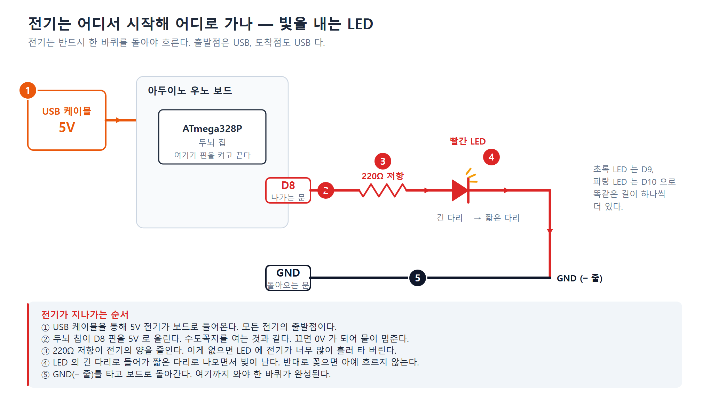
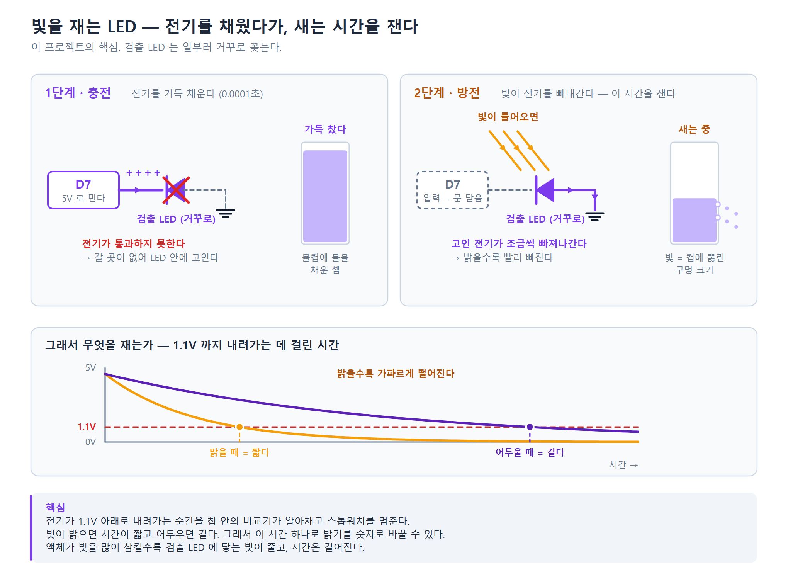
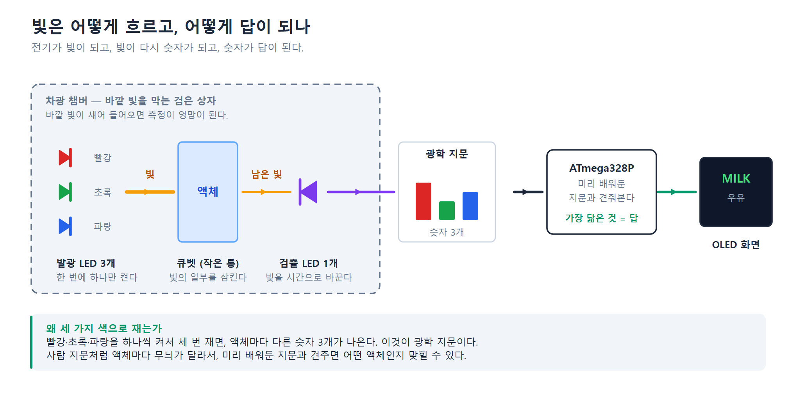

# 이 프로젝트, 쉽게 알아보기

> 처음 보는 사람을 위한 설명서입니다. 전자공학을 몰라도 읽을 수 있게 썼습니다.
> 정확한 수치와 회로 이론은 [계획서](../LED_PEDD_계획서_최종본.pdf)와
> [README](../README.md)에 있습니다.

---

## 1. 한 줄로 말하면

**컵에 담긴 액체가 무엇인지 맞히는 기계**를 만들고 있습니다.
그런데 카메라도, 센서도 쓰지 않고 **꼬마전구(LED) 4개**만으로 만듭니다.

물인지, 색소를 탄 물인지, 우유를 탄 물인지 — 기계가 화면에 답을 띄웁니다.

---

## 2. 왜 이게 신기한 일일까?

보통 이런 기계를 만들려면 **빛을 재는 전용 부품**(광센서)이 필요합니다.
비싸고, 구하기도 번거롭습니다.

우리는 그 부품을 **아예 쓰지 않습니다.** 대신 문방구에서도 파는
평범한 LED를 씁니다. 그래서 전체 부품값이 아주 쌉니다.

| | 보통의 방법 | 우리 방법 |
|---|---|---|
| 빛을 내는 것 | LED | LED 3개 |
| 빛을 재는 것 | 전용 광센서 (비쌈) | **LED 1개** |
| 값 | 비쌈 | 쌈 |

---

## 3. LED의 숨은 비밀

LED는 **빛을 내는** 부품으로 알려져 있습니다. 그런데 사실 LED에는
반대 능력도 있습니다.

> **LED에 빛을 비추면, 아주 약하지만 전기가 만들어집니다.**

태양광 패널의 아주아주 작은 버전이라고 생각하면 됩니다.
이 프로젝트는 바로 이 숨은 능력을 이용합니다.

- LED 3개 → 빛을 **내는** 담당 (빨강 · 초록 · 파랑)
- LED 1개 → 빛을 **느끼는** 담당 (검출용)

---

## 4. 전기는 어디서 시작해서 어디로 갈까?

가장 먼저 알아야 할 것은 **전기는 반드시 한 바퀴를 돌아야 흐른다**는 점입니다.
출발만 하고 돌아오지 않으면 아무 일도 일어나지 않습니다.
미끄럼틀이 아니라 **뺑뺑이(회전목마)** 에 가깝습니다.



### 순서대로 따라가 보기

| 번호 | 어디서 | 무슨 일이 |
|:--:|---|---|
| ① | USB 케이블 | 컴퓨터에서 **5V 전기**가 보드로 들어옵니다. 모든 것의 출발점입니다. |
| ② | 두뇌 칩 → D8 핀 | 칩이 D8 핀을 5V로 올립니다. **수도꼭지를 여는 것**과 같습니다. |
| ③ | 220Ω 저항 | 전기의 양을 줄입니다. **과속방지턱**이라고 생각하세요. 없으면 LED가 타 버립니다. |
| ④ | 빨간 LED | 긴 다리로 들어가 짧은 다리로 나오면서 **빛이 납니다.** |
| ⑤ | GND(− 줄) | 다시 보드로 **돌아옵니다.** 여기까지 와야 한 바퀴 완성입니다. |

초록 LED는 D9 핀, 파랑 LED는 D10 핀으로 **똑같은 길이 하나씩 더** 있습니다.
칩이 어느 핀을 켜느냐에 따라 어느 색이 켜질지 정해집니다.

> **꼭 기억할 것**
> LED는 방향이 있습니다. **긴 다리 → 짧은 다리** 방향으로만 전기가 흐릅니다.
> 거꾸로 꽂으면 전기가 아예 흐르지 않아서 불이 안 켜집니다.

---

## 5. 그럼 빛은 어떻게 "재는" 걸까?

여기가 이 프로젝트에서 가장 중요한 부분입니다.

검출용 LED는 **일부러 거꾸로 꽂습니다.** 실수가 아니라 의도입니다.
그리고 두 단계로 나눠서 측정합니다.



### 1단계 — 물컵에 물 채우기 (충전)

칩이 D7 핀을 5V로 밀어 넣습니다. 그런데 LED가 거꾸로 꽂혀 있어서
**전기가 통과하지 못합니다.** 갈 곳이 없어진 전기는 LED 안에 **고입니다.**

물컵에 물을 가득 채우는 것과 같습니다. 걸리는 시간은 **0.0001초**입니다.

### 2단계 — 새는 시간 재기 (방전)

이제 칩이 D7 핀의 문을 닫습니다(핀을 '입력'으로 바꿉니다).
고인 전기는 이제 나갈 길이 없습니다. 가만히 두면 그대로 있어야 합니다.

**그런데 빛이 들어오면 이야기가 달라집니다.**
LED가 빛을 전기로 바꾸기 시작하고, 고여 있던 전기가 조금씩 빠져나갑니다.

> 컵에 구멍이 뚫린 셈입니다.
> **빛이 밝을수록 구멍이 크고, 물이 빨리 빠집니다.**

### 그래서 무엇을 재는가

전기가 **1.1V 아래로 내려가는 순간**을 칩 안의 '비교기'라는 부품이 알아채고
스톱워치를 멈춥니다.

| 빛의 밝기 | 전기가 빠지는 속도 | 잰 시간 |
|---|---|---|
| 밝음 | 빠르다 | **짧다** |
| 어두움 | 느리다 | **길다** |

이렇게 해서 **"밝기"라는 눈에 보이는 것을 "시간"이라는 숫자로** 바꿉니다.
컴퓨터는 숫자만 다룰 수 있으니까요.

---

## 6. 액체를 어떻게 알아맞힐까?

빛이 액체를 지나갈 때, 액체는 **빛의 일부를 삼킵니다.**
그리고 액체마다 삼키는 양이 다릅니다.

- 맑은 물 → 빛을 거의 안 삼킴 → 검출 LED에 빛이 많이 도착 → **시간 짧음**
- 우유 탄 물 → 빛을 많이 삼킴 → 빛이 조금 도착 → **시간 김**



### 색깔 하나로는 부족합니다

빨간 빛만으로 재면 "빨간 색소물"과 "우유물"이 우연히 비슷한 값이 나올 수
있습니다. 그래서 **빨강 · 초록 · 파랑을 하나씩 켜서 세 번** 잽니다.

그러면 액체마다 숫자 **세 개**가 나옵니다. 이걸 **광학 지문**이라고 부릅니다.

| 액체 | 빨강 | 초록 | 파랑 |
|---|:--:|:--:|:--:|
| 맑은 물 | 짧음 | 짧음 | 짧음 |
| 빨간 색소물 | 짧음 | **김** | **김** |
| 우유물 | 김 | 김 | 김 |

> 위 표는 **원리를 보여주는 예시**입니다. 하드웨어를 아직 조립하지 않아서
> 실제로 잰 값이 아닙니다. 진짜 값은 측정한 뒤 `data/` 폴더에 들어갑니다.

빨간 색소물이 빨간 빛은 잘 통과시키고 초록·파랑은 많이 삼키는 것처럼,
사람 지문처럼 액체마다 무늬가 다릅니다.
기계는 **미리 배워둔 지문**과 견줘서 가장 닮은 것을 답으로 내놓습니다.

---

## 7. 어떻게 쓰나요?

버튼 하나로 다 됩니다.

```
버튼을 길게(2초) 누른다  →  학습 모드
                            증류수 → 색소물 → 우유물 순서로 하나씩 재서 외운다

버튼을 짧게 누른다       →  측정
                            지금 들어 있는 액체가 뭔지 맞힌다  →  화면에 표시
```

화면에는 영어로 나옵니다. `DISTILLED WATER`(증류수) · `DYE WATER`(색소물) ·
`MILK`(우유물) 셋 중 하나입니다.

전원을 처음 켜면 화면에 `NOT TRAINED`(아직 안 배웠음)가 뜹니다.
**먼저 길게 눌러서 가르쳐 줘야** 맞힐 수 있습니다.
한 번 배운 내용은 전원을 꺼도 기억합니다.

---

## 8. 부품 소개

| 부품 | 몇 개 | 하는 일 |
|---|:--:|---|
| 아두이노 우노 보드 | 1 | 두뇌. 핀을 켜고 끄고, 시간을 재고, 판단한다 |
| 발광 LED (빨강·초록·파랑) | 3 | 액체에 빛을 비춘다 |
| **검출 LED (빨강)** | 1 | 도착한 빛의 양을 시간으로 바꾼다 |
| 저항 (220Ω부터) | 3 | 발광 LED에 전기가 너무 많이 흐르지 않게 막는다 |
| 버튼 | 1 | 측정 시작 / 학습 시작 |
| OLED 화면 | 1 | 결과를 보여준다 |
| 큐벳 | 여러 개 | 액체를 담는 작은 투명 통 |
| 차광 챔버 | 1 | 바깥 빛을 막는 검은 상자 |
| 브레드보드 · 점퍼선 | — | 납땜 없이 부품을 잇는 판과 전선 |

> **저항값이 "220Ω부터"인 이유**
> 220Ω은 시작값입니다. 실제로 재보고 빛이 너무 세면 값을 올리고(330·470·1k),
> 너무 약하면 내립니다. 그래서 여러 값을 함께 사둡니다.

> **왜 차광 챔버가 필요할까?**
> 형광등이나 햇빛이 조금만 새어 들어와도 검출 LED가 그 빛까지 세어 버립니다.
> 그러면 액체를 바꿔도 값이 안 변합니다. 그래서 검은 상자 안에서 측정합니다.

> **왜 검출 LED는 꼭 빨간색일까?**
> LED는 **자기가 내는 빛보다 에너지가 센 빛**만 느낄 수 있습니다.
> 빨간 LED는 빨강·초록·파랑을 전부 느끼지만, 파란 LED는 파랑밖에 못 느낍니다.
> 검출 LED 하나로 세 가지 색을 다 받아야 하니 **빨간색이어야 합니다.**
> 파란색을 사면 측정이 아예 안 됩니다.

---

## 9. 어려운 말 사전

| 말 | 쉬운 뜻 |
|---|---|
| MCU / ATmega328P | 아주 작은 컴퓨터 칩. 이 기계의 두뇌 |
| 핀 (D7, D8, A4 …) | 칩 밖으로 나온 다리. 전기가 드나드는 문 |
| GND (그라운드) | 전기가 돌아오는 길. 모든 회로의 공통 출발선 |
| 5V, 1.1V | 전기를 미는 힘의 세기. 숫자가 클수록 세다 |
| 저항 (220Ω) | 전기가 지나가기 힘들게 만드는 부품. 과속방지턱 |
| 애노드 / 캐소드 | LED의 긴 다리 / 짧은 다리 |
| 충전 / 방전 | 전기를 채우기 / 전기가 빠져나가기 |
| PEDD | 이 측정 방식의 이름. "LED로 빛을 내고 LED로 받는다"는 뜻 |
| 광학 지문 | 한 액체에서 나온 숫자 세 개 묶음 |
| 펌웨어 | 칩 안에 넣는 프로그램 |
| 브레드보드 | 납땜 없이 부품을 꽂아 잇는 구멍 뚫린 판 |

---

## 10. 더 자세히 보려면

| 궁금한 것 | 볼 곳 |
|---|---|
| 실제로 어디에 꽂는지 | [`docs/배선도.pdf`](배선도.pdf) — 구멍 번호까지 나온 그림 4장 |
| 검은 상자 만드는 법 | [`docs/제작도면.pdf`](제작도면.pdf) · [`docs/차광챔버_제작.md`](차광챔버_제작.md) |
| 프로그램 넣는 법 | [`firmware/README.md`](../firmware/README.md) |
| 정확한 회로와 계산 | [`LED_PEDD_계획서_최종본.pdf`](../LED_PEDD_계획서_최종본.pdf) |
| 부품 고른 이유 | [`구매목록.md`](../구매목록.md) |

---

## 이 문서의 그림은 어떻게 만드나

그림 3장은 손으로 그린 것이 아니라 스크립트가 만듭니다.
핀 번호가 바뀌면 그림도 같이 고쳐야 하므로, 값을 한곳에 모아 두었습니다.

```sh
sh tools/make_flow_png.sh    # SVG 3장 + PNG 3장까지 한 번에
```

SVG 와 PNG 를 둘 다 두는 이유가 있습니다.

| 형식 | 쓰는 곳 | 이유 |
|---|---|---|
| PNG | 이 문서, GitHub 웹 | 어느 컴퓨터에서 봐도 글꼴이 같게 나온다 |
| SVG | 인쇄, 발표 슬라이드 | 벡터라서 아무리 키워도 글자가 안 흐려진다 |

핀 배정을 바꾸려면 **펌웨어를 먼저** 고치세요
(`firmware/common/pedd.c`). 그림은 그다음입니다.
